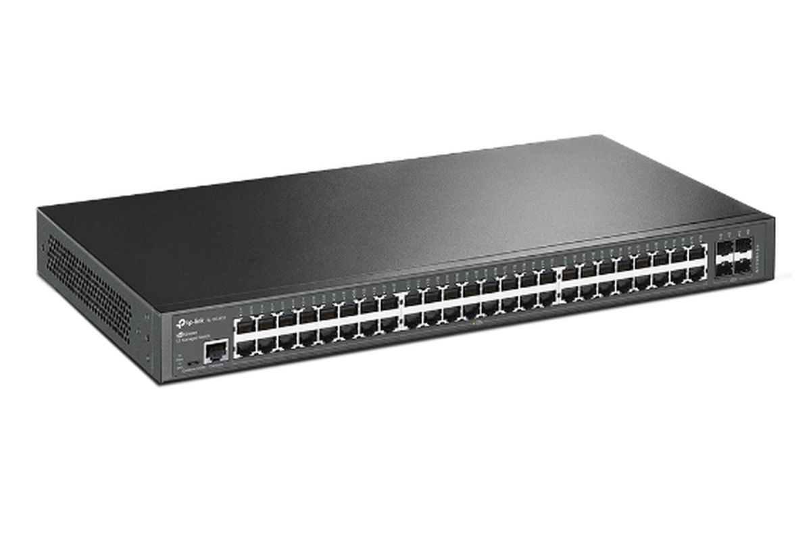

<!DOCTYPE html>
<html lang="en">
<head>
    <meta charset="UTF-8">
    <meta name="viewport" content="width=device-width, initial-scale=1.0">
    <title>Biodata dan Materi Jaringan Komputer</title>
    
</head>
<body class="bg-gradient-to-r from-pink-300 via-purple-300 to-blue-300 text-gray-800 h-screen overflow-y-auto">
    

        <!-- Header -->
        <header class="text-center mb-10">
            <h1 class="text-4xl font-bold text-blue-700 mb-4">Jaringan Komputer</h1>
            
Welcome to feb's web!!

        </header>

        

            <!-- Biodata Section -->
            

                <h2 class="text-2xl font-bold text-blue-600 mb-4">Biodata</h2>
                

                    
                    

                        
<strong>Nama:</strong> Khansa Feby Olivia

                        
<strong>NIM:</strong> 607012400126

                        
<strong>Kelas:</strong> 48-02

                        
<strong>Jurusan:</strong> D3 Sistem Informasi

                        
<strong>Mata Kuliah:</strong> Jaringan Komputer

                    

                

            

            <!-- Materi Jaringan Komputer Section -->
            

                <h2 class="text-2xl font-bold text-purple-600 mb-4">Perantara Jaringan Komputer: Switch</h2>
                

                    
                    

                        
<strong>Fungsi:</strong> Switch adalah perangkat jaringan yang berfungsi untuk menghubungkan beberapa perangkat dalam satu jaringan lokal (LAN) dan memfasilitasi komunikasi antar perangkat tersebut.

                        
<strong>Jenis:</strong>

                        <ul class="list-disc pl-5 text-purple-700 mb-4">
                            <li>Unmanaged Switch</li>
                            <li>Managed Switch</li>
                            <li>Smart Switch</li>
                        </ul>
                        
Sumber: <a href="https://id.wikipedia.org/wiki/Jaringan_komputer" target="_blank" class="text-blue-500 hover:underline">Wikipedia</a>

                    

                

            

        

        <!-- Links Section -->
        

            <h2 class="text-2xl font-bold text-pink-600 mb-4">Tutorial dan Referensi</h2>
            

                <a href="https://www.hostingadvice.com/how-to/" target="_blank" class="text-blue-500 hover:underline">Tutorial Hosting</a>
                <a href="https://drive.google.com/file/d/1w7ePo8jeZp9h49mZI79SeqJ2_bGbc7pv/view?usp=sharing" target="_blank" class="text-blue-500 hover:underline">Tutorial Pembuatan Website</a>
            

        

    

    <footer class="bg-blue-400 text-white text-center py-3">
        
&copy; 2024 Biodata Web

    </footer>

</body>
</html>
